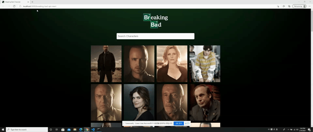

# **Breaking Bad Character Search**

## **Greetings!**
### **_This is the Breaking Bad Character Searcher app utilizing React hooks._** 
---
## **Description:**
#### **_With the use of the "Breaking Bad API": <https://www.breakingbadapi.com/api/>, This program allows user to search for their favorite Breaking Bad character information by searching characters' name."_**
---
## **Example Gif:**

## **Link to the video: <https://drive.google.com/file/d/1Rab2nWxi2CG1GmLV7i1BnMTfsBEqcIMO/view>**

---
## **Guidline:**
### 1. **Start:** 
#### -Follow the link: <https://ahnlok.github.io/breaking-bad-api-react/>
### 2. **Main Page:**
#### -On the main page, user will be able to see all the listed characters from the Breaking Bad API.
### 3. **Search:**
#### -The user can search for the character information by start typing by character name.
#### (Each letter will filter the names of character as the user types through).
### 4. **Search Result:**
#### -Similar to the start of the webpage, the user will be able to see the filtered character information according to the search input by name.
---

## **Installation**
### **_git clone: <git@github.com:ahnlok/breaking-bad-api-react.git>_**

---

## **GitHub**
### **_GitHub_**: **<https://github.com/ahnlok/breaking-bad-api-react>**
### **_Deployed Github Site_**: **<https://ahnlok.github.io/breaking-bad-api-react/>**
---

## **Credit**
### **This app is from Traversy Media's "React App - Breaking Bad API" <https://www.youtube.com/watch?v=YaioUnMw0mo&list=PLh1RaM1IojKHSXyZX7de5zN71Aa499OOz&index=11>**

---

## **Contact**
### **_E-Mail_**: **<ansungpil1@gmail.com>**
### **_LinkedIn_**: **<https://www.linkedin.com/in/an-sungpil-95ab8490/>**
### **_GitHub_**: **<https://github.com/ahnlok>**

---
## **License**
### **© Sungpil An 2021**

#### _Licensed under the MIT License_